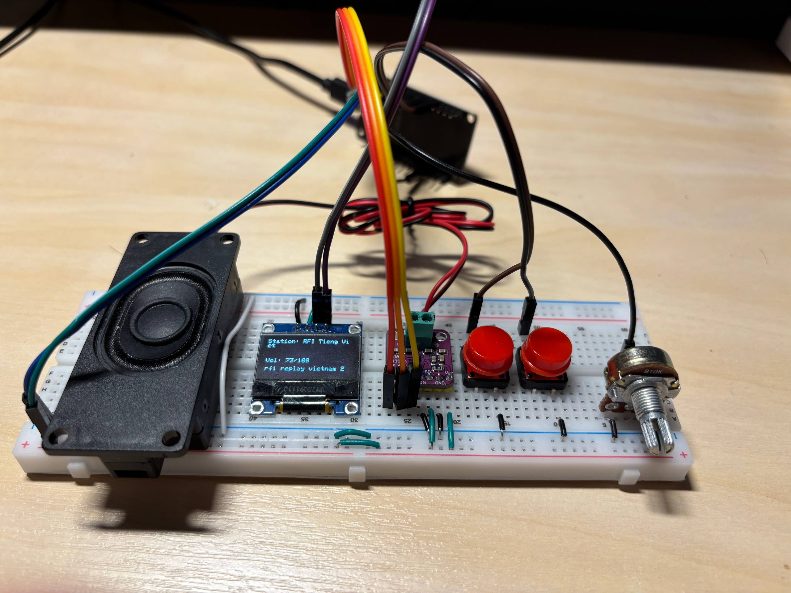
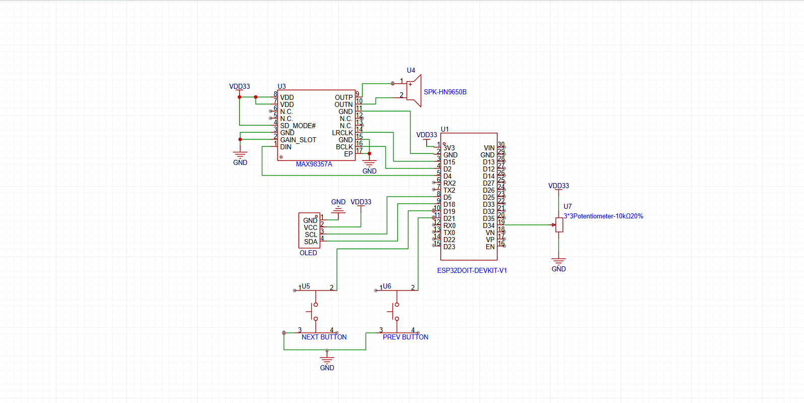

# ESP32 Internet Radio 

## 📌 Overview

This project implements an **ESP32 based Internet Radio** using WI-Fi connectivity to stream online radio station in real time.
Audio data is decoded and output via **I2S** to a **MAX98357A digital audio amplifier**, connecting to a speaker.
System status and playback information are displayed on an **OLED 128x64 Display**.
A **potentiometer** is used for real-time volume control, and **2 push-buttons** are added for station navigation.

---

## 🎯 Objectives
- Get used to built-in internet connectivity via Wi-Fi on ESP32
- Implementing real-time audio streaming over internet
- Output digital audio using I2S protocol
- Implement analog input using ESP32 ADC
- Build a modular and professional embedded Internet Radio system

---

## 🛠 Hardware Components
- ESP32DOIT DEVKIT V1
- OLED 128*64 Display
- Push button (x2)
- MAX98357A Audio Amplifier
- Speaker Module
- Potentiometer 10kΩ
- Breadboard & jumper wires

---

## 🔌 Pinout (ESP32 ↔ OLED)

| OLED Pin |     Function    | ESP32 Pin |
|---------|-----------------|-------------|
|   GND   |     Ground      |     GND     |
|   VCC   |     Power       |     3V3      |
|   SCL    |     Clock Signal    |     D5     |
|   SDA    | Data Transfer |     D18      |

## 🔌 Pinout (ESP32 ↔ MAX98357A)
| MAX98357A |     Function    | ESP32 Pin |
|---------|-----------------|-------------|
|   LRC   |     Left/Right Clock      |     D15     |
|   BCLK   |     Bit Clock       |     D2      |
|   DIN    |     Data Input    |     D4     |
|   GAIN    |     Gain    |     GND     |
|   SD   |     Shutdown    |     3V3     |
|   GND    |     Ground    |     GND     |
|   VIN    |     Power    |     3V3    |

## 🔌 Pinout (ESP32 ↔ Potentiometer)
| Potentiometer |     Function    | ESP32 Pin |
|---------|-----------------|-------------|
|   VCC   |     Power      |     3V3     |
|   GND   |     Ground       |     GND      |
|   OUT    |     Analog Signal    |     D34     |

### Other Connections

| Component | ESP32 Pin |       Notes       |
|-----------|-------------|-------------------|
|  Button (Prev/Next)   |     D21/D19      |    INPUT_PULLUP   |
---

## 📐 Wiring Diagram


> The wiring was created using real hardware components

---

## 🧩 Schematic


> The schematic illustrates logical connections between ESP32, OLED, MAX98357A, and input devices.

---

## ▶ Demo


---

### Run (PlatformIO)

1. Open this folder in VS Code.
2. Select the correct environment & board in `platformio.ini`.
3. Build/Upload/Monitor using PlatformIO toolbar, or terminal:
```bash
pio run
pio run -t upload
pio device monitor -b 9600
```
---

## 🧠 Implementation Notes
- Audio streaming handled over Wi-Fi using HTTP radio stream
- Digital audio output via I2S to MAX98357A
- OLED display used for Wi-Fi status, IP address, station name and volume level
- Potentiometer input filtered and mapped using ESP32 ADC

---

## 📚 What I Learned
- Implementing Internet-based audio streaming on an embedded system
- Understanding and using the I2S protocol for digital audio output
- Handling analog inputs with ESP32 ADC for real-time control
- Integrating networking, audio, display, and user input in one system
- Structuring an embedded project in a professional and maintainable way

---

## 👤 Author
Hoang Bui - 2nd year Embedded Student

---

## 📄 License
This project is for educational purposes only.